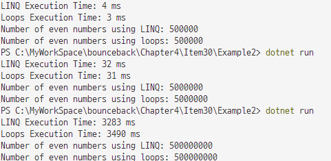

# Chapter [3]: 제네릭 활용

## item[29]: 컬렉션을 반환하기보다 이터레이터를 반환하는 것이 낫다

- 이터레이터(Iterator)
  - 데이터 컬렉션을 순회할 수 있는 객체. yield return 키워드를 사용하여 구현할 수 있다.
- yield return
  - 이터레이터를 구현하는 데 사용되는 C#의 키워드로, 메서드가 반환할 값을 하나씩 순차적으로 생성. 메서드가 호출될 때마다 중단된 위치에서 계속 실행됨.

## item[30]: 루프보다 쿼리 구문이 낫다

- 루프를 사용하는 코드보다 LINQ를 사용하는 코드는 더 간결하고, 유지보수하기 쉽다.

- 
  - DataSet이 커질수록 LINQ가 더 빠르네...??
- LINQ의 지연 실행 (Deferred Execution)
  - 쿼리가 정의된 시점이 아니라 쿼리가 실제로 사용되는 시점에 실행된다는 것. 이로 인해 성능 최적화와 메모리 효율이 제공됨.

## item[31]: 시퀀스에 사용할 수 있는 조합 가능한 API를 작성하라

- 반복적인 작업을 메서드로 분리하여 코드의 재사용성과 가독성을 높일 수 있다.
- 지연 실행: yield return을 사용하여 지연 실행을 구현하면, 실제 결과가 필요할 때까지 연산을 미루어 성능을 최적화할 수 있음.
- IEnumerable<T> 반환: 시퀀스를 반환하는 메서드는 IEnumerable<T>를 반환하도록 작성하면 작업을 체인으로 연결할 수 있게 할 수 있음.

## item[32]: Action. Predicate, Function과 순회 방식을 분리하라

- Action: 반환 값이 없는 메서드를 나타내는 델리게이트. 하나 이상의 매개변수를 받을 수 있음.
- Predicate: 특정 조건을 만족하는지 여부를 나타내는 델리게이트. 하나의 매개변수를 받고 bool을 반환.
- Function: 반환 값이 있는 메서드를 나타내는 델리게이트. 하나 이상의 매개변수를 받을 수 있으며, 결과를 반환.

## item[33]: 필요한 시점에 필요한 요소를 생성하라

- 지연 계산 기법은 특히 대용량 데이터를 다루거나, 계산 비용이 높은 작업을 지연시킬 때 큰 이점을 제공한다. C#에서는 yield 키워드를 통해 이러한 지연 계산 방식을 간단하게 구현할 수 있음. 이는 코드의 가독성을 향상시키고, 성능 최적화에도 도움.

## item[34]: 함수를 매개변수로 사용하여 결합도를 낮추라

- 인터페이스나 베이스 클래스를 정의하여 메서드를 구현할 수도 있지만, 때로는 델리게이트를 사용하여 API를 단순화하는 것이 더 효율적.
- 델리게이트를 사용하면 컴포넌트 간의 결합도를 낮출 수 있으며, 이는 단위 테스트와 코드 재사용성을 높이는 데 도움이 된다.
  그러나 이 방법은 코드 복잡도를 증가시킬 수 있으며, 추가적인 오류 처리 작업이 필요.

## item[35]: 확장 메서드는 절대 오버로드하지 마라

- 네임스페이스를 기반으로 어떤 메서드를 호출할지를 결정하는 방식은 구조가 취약.
- 확장 메서드를 여러 네임스페이스 걸쳐 오버로드 X

## item[36]: 쿼리 표현식과 메서드 호출 구문이 어떻게 대응되는지 이해하라

- LINQ (Language Integrated Query): C#과 같은 .NET 언어에서 데이터 소스에 대해 쿼리를 수행할 수 있도록 하는 통합된 쿼리 언어.
- 쿼리 표현식(Query Expression): LINQ 쿼리를 SQL과 유사한 구문으로 작성하는 방식.
- 메서드 호출 구문(Method Call Syntax): 메서드 체인을 사용하여 LINQ 쿼리를 작성하는 방식.
- 데이터 소스(Data Source): LINQ 쿼리를 수행하는 대상 데이터 컬렉션.

## item[37]: 쿼리를 사용할 때는 즉시 평가보다 지연 평가가 낫다

- 즉시 평가(Immediate Evaluation): 쿼리가 정의되는 즉시 데이터를 처리하고 결과를 반환하는 방식.
- 지연 평가(Deferred Evaluation): 쿼리가 정의될 때는 데이터 처리를 미루고, 실제로 데이터가 필요할 때 처리를 수행하는 방식.